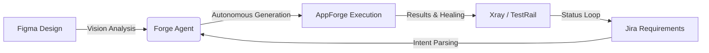

# 🚀 AppForge: The Future of Agentic Mobile QA

## 💼 Executive Summary
**AppForge** is a next-generation, AI-native automation framework designed to eliminate the 'maintenance tax' associated with mobile testing. Unlike traditional frameworks that are reactive and brittle, AppForge uses a **multi-modal, agentic approach** to understand application intent, repair its own test scripts, and continuously learn from project-specific patterns.

> [!TIP]
> **The Bottom Line**: AppForge transitions mobile QA from manual script-writing to high-velocity autonomous orchestration, reducing locator maintenance by an estimated **70-80%**.

---

## 🏗️ The Three Pillars of AppForge

### 1. 🩹 Autonomous Self-Healing
Traditional tests break when a developer changes a button ID or moves a UI element. **AppForge heals itself.** When a test fails, the agent automatically captures the live UI hierarchy and screenshot, identifies the structural change, proposes a fix, and updates the Page Object—all before the next run.

### 2. 👁️ Vision-Language Understanding
AppForge doesn't just read code; it "sees" the app. By combining raw XML hierarchy with visual screenshots, the agent can understand complex UI states, identify accessibility gaps, and generate locators that are inherently more stable across different screen sizes and operating systems.

### 3. 🧠 Continuous Project Learning
Every manual correction or successful healing operation is stored in the project's **AI Memory**. Over time, AppForge learns your specific coding standards, naming conventions, and common UI quirks, making it smarter and faster with every execution.

---

## ⚡ Token Efficiency & Cost Optimization
AppForge is engineered for enterprise-scale deployment where LLM token costs are a critical consideration.

- **Turbo Mode Analysis**: Instead of re-reading massive source files, the engine uses **Abstract Syntax Tree (AST) parsing** to surgically extract only the necessary code context. This reduces token consumption by up to **90%** compared to naive file reads.
- **Smart Context Filtering**: During UI inspection, AppForge filters the raw XML hierarchy to send only the relevant interactive nodes to the LLM, preventing "context bloat" and improving response accuracy.
- **Local Sandbox Execution**: Complex data filtering and analysis happen in a **local V8 sandbox**. This ensures that only the final, distilled results are sent to the LLM, maximizing the value of every prompt.
- **Persistent AI Memory**: By storing learned rules locally in `.mcp-knowledge.json`, the agent avoids repetitive "re-learning" sequences, significantly lowering the token overhead for recurring tasks.

---

## 🛠️ The AppForge Tool Catalog (v1.0 Live)
Currently, AppForge provides **16 specialized tools** that cover the entire automation lifecycle.

### 🔌 Initialization & DevOps
| Tool | Purpose | Value Proposition |
| :--- | :--- | :--- |
| `setup_project` | First-time scaffolding. | Sets up a production-ready POM project in seconds. |
| `manage_config` | Core capabilities & device config. | Unified management of Android/iOS profiles and cloud providers. |
| `generate_ci_workflow` | CI/CD Integration. | Automates GitHub Actions/GitLab CI setup with one command. |
| `manage_users` | Multi-env credential management. | Securely manages test accounts across Staging and Production. |

### 🧠 Intelligence & Authoring
| Tool | Purpose | Value Proposition |
| :--- | :--- | :--- |
| `generate_cucumber_pom` | AI-driven test generation. | Transforms plain English requirements into BDD/POM code. |
| `validate_and_write` | Syntax-aware file saving. | Ensures all generated code is syntactically perfect before writing. |
| `migrate_test` | Legacy to Appium migration. | Converts Espresso/XCUITest scripts to a unified Appium format. |
| `train_on_example` | Persistent AI instruction. | Teaches the agent project-specific rules to prevent recurring bugs. |

### 🩹 Resiliency & Healing
| Tool | Purpose | Value Proposition |
| :--- | :--- | :--- |
| `self_heal_test` | Broken locator repair. | **Zero-maintenance execution.** Identifies and fixes selector drift. |
| `verify_selector` | Real-time validation. | Proactively tests locators on active devices before saving code. |
| `start_appium_session` | Multi-platform connectivity. | Seamless connection to emulators, simulators, and cloud farms. |
| `end_appium_session` | Resource cleanup. | Ensures clean device release after every session. |

### 📊 Diagnostics & Quality
| Tool | Purpose | Value Proposition |
| :--- | :--- | :--- |
| `inspect_ui_hierarchy` | Multi-modal screen analysis. | Returns live XML + Screenshots for deep UI debugging. |
| `audit_mobile_locators` | Health monitoring. | Scans entire Page Objects for brittle or non-accessible strategies. |
| `analyze_codebase` | Turbo-speed understanding. | Uses AST to map dependencies and reuse existing code modules. |
| `export_bug_report` | Automated Jira generation. | Turns test failures into rich, detailed bug reports automatically. |

---

## 🗺️ Strategic Roadmap (Phase 2: Planned)
We are evolving AppForge from a standalone engine into a central **Quality Intelligence Hub**.

> [!NOTE]
> **Future Integrations Highlight:**
> - **Figma Vision Sync**: Automatically generate tests directly from design frames.
> - **Jira Acceptance Criteria Mapping**: Bidirectional sync between user stories and Gherkin scenarios.
> - **Observability Integration**: Prioritize tests based on Datadog/Sentry production error logs.

---

## 🎯 ROI & Competitive Advantage

| Capability | Legacy Automation | AppForge Advantage |
| :--- | :--- | :--- |
| **Locator Maintenance** | Manual, time-consuming. | **Autonomous Self-Healing.** |
| **Framework Setup** | Hours/Days. | **Minutes (setup_project).** |
| **New Test Velocity** | Scripting-intensive. | **Intent-driven (English to Code).** |
| **Knowledge Transfer** | Dependent on documentation. | **AI Memory (Persistent Learning).** |

---

## 🚀 Next Steps
1. **Pilot Project**: Select one core flow (e.g., Checkout) for migration to AppForge.
2. **Audit & Hardening**: Run `audit_mobile_locators` on current projects to clear technical debt.
3. **CI/CD Integration**: Baseline the current execution through `generate_ci_workflow`.

**Ready to Forge the Future of Mobile Quality.**
